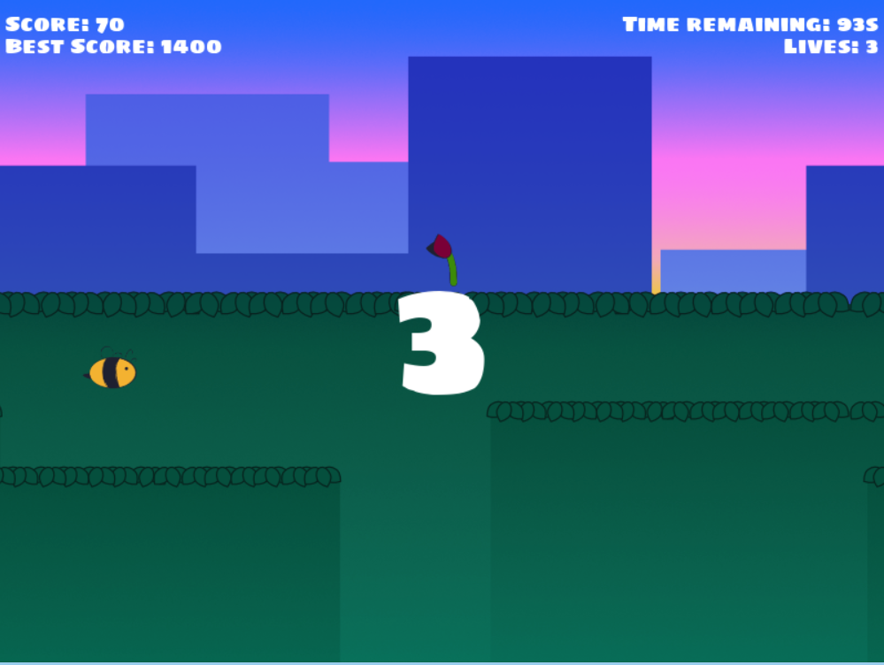
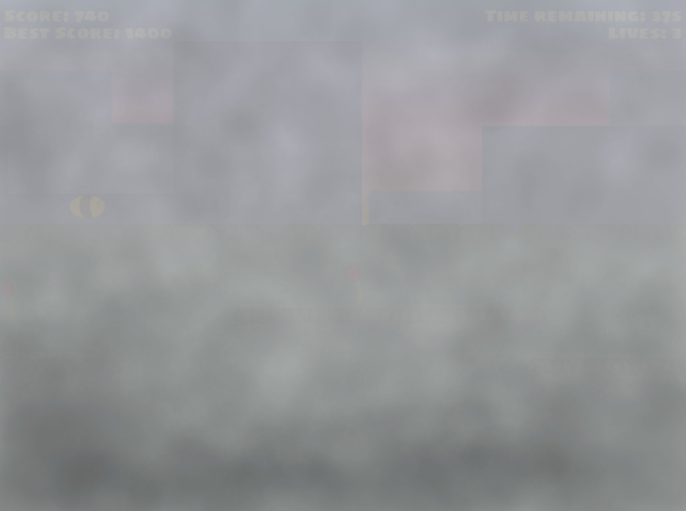
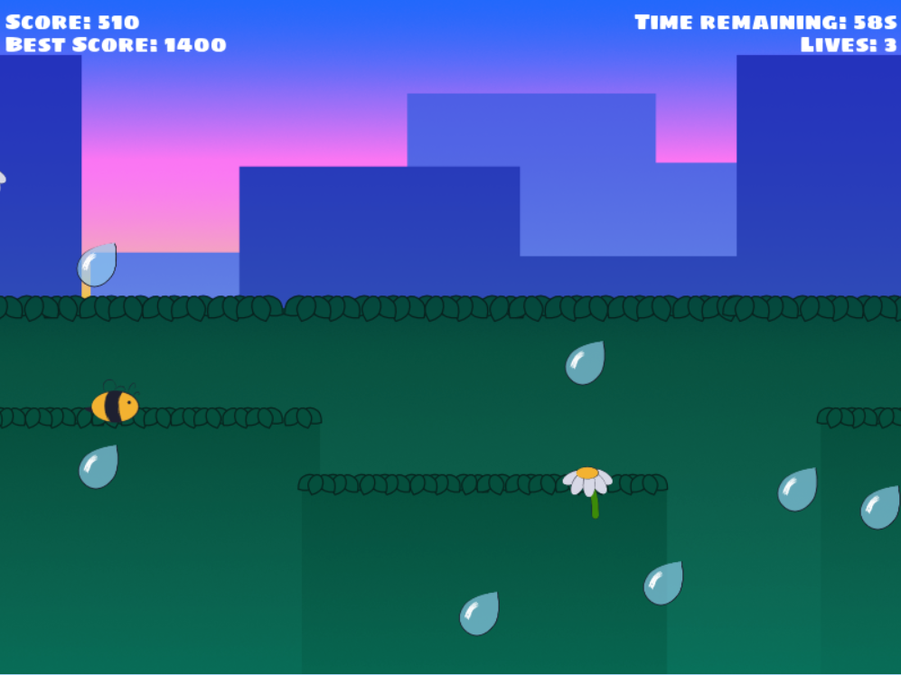
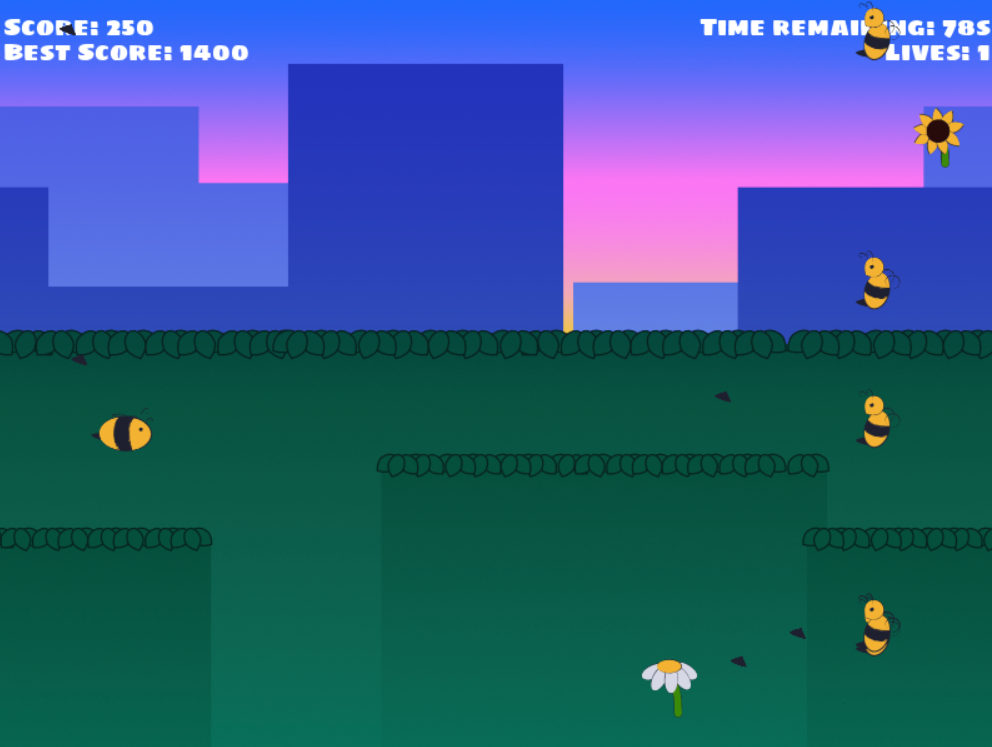

# ScramBumble

Help Bumble on their quest for nectar!

  - [How to Play](#how-to-play)
  - [Events](#events)
    - [Clouds](#clouds)
    - [Rain](#rain)
    - [Wasps](#wasps)
  - [Supported Platforms](#supported-platforms)
    - [LÖVE](#löve)
    - [Windows](#windows)
    - [Web](#web)
    - [Mobile](#mobile)
  - [About this Build](#about-this-build)
  - [Game Engine](#game-engine)
    - [Libraries](#libraries)

## How to Play

Bumble will follow your mouse up and down the screen. Your aim is to collect as many flowers as possible in 100 seconds.

Different flowers score different amounts of points:

1. Daisy: 20
2. Tulip: 50
3. Sunflower: 70

The higher the score, the harder they are to catch!

**But that's not all...**

Every 10 seconds (with a following 10 second cooldown) Bumble will face some kind of misfortune which you must help them navigate.

*Note: Given the randomised nature of the event calls, you're not guaranteed to see every event in one run.*

You will see a timer on screen which counts down to each event.

## Events

### Clouds

Help Bumble collect flowers through the fog.

### Rain

Bumble can't fly in the rain! Try your best to avoid the droplets while still collecting flowers. Be careful: Rain is not lethal to Bumble, however, they will fall to the ground if hit.

### Wasps

These angry wasps aren't happy with Bumble's nectar-collecting ways and will try to knock them out! Be careful: If Bumble is hit **three times** by the stingers, it's **Game Over**. Thankfully, Bumble is resilient and, after every wasp event, will regenerate their three lives.

*Note: Currently, this is the only way to Game Over*

## Supported Platforms

### LÖVE

If you have LÖVE installed on your system, simply run the [ScramBumble.love](ScramBumble.love) file.

### Windows

To play the game on Windows, download and unzip the [ScramBumble.exe.zip](ScramBumble.exe.zip) file and run the .exe file inside. Keep all these files together or it won't work!

### Web

You can play ScramBumble in browser on [GitHub Pages](https://robeecodes.github.io/scrambumble/).

### Mobile

ScramBumble does not have a dedicated mobile version, however, if you click "Go Fullscreen" on the web version, you can play it right there on your phone! It's recommended to play horizontally.

*Note: A dedicated mobile version may be available in the future*

## About this Build

This game was produced for *Ludum Dare 51* and was my first attempt at a game jam! As such, ScramBumble is currently very small in scope and could use some refining. I currently plan to revisit this project in the future and add more features such as:

- Story Mode
- More Events
- Power Ups
- etc...

All graphics were created by me using [Affinity Designer](https://affinity.serif.com/en-gb/designer/) and the sound effects were created in [SFXR](https://sfxr.me). The font used is [Sigmar One](https://fonts.google.com/specimen/Sigmar+One) from Google Fonts.

## Game Engine

This game was written in Lua and created using the [LÖVE](https://love2d.org) engine, which is completely free and open source.

### Libraries

I also used some libraries to aid in the creation of this game:

[anim8](https://github.com/kikito/anim8): An animation library for LÖVE.

[love.js](https://github.com/Davidobot/love.js): To create the web version of ScramBumble.

[show](https://github.com/kyleschaub/udemy-love2d): Allows LÖVE to save data.

[windfield](https://github.com/a327ex/windfield): A physics module for LÖVE.

**Thank you for playing!**